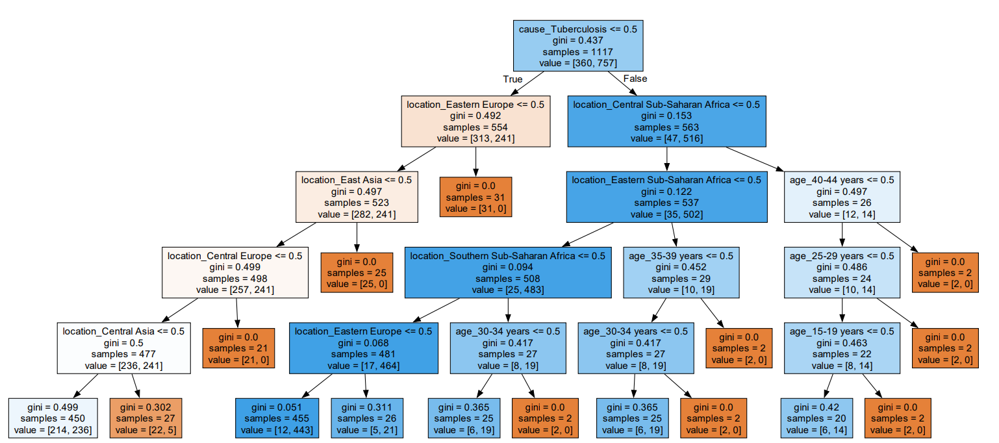

Data source: https://vizhub.healthdata.org/gbd-results/


```{r setup, include=FALSE}
knitr::opts_chunk$set(echo = TRUE)

library('reticulate')   #allows using Python
use_python('C:/Users/wrtlb/AppData/Local/Programs/Python/Python311/python.exe')  # .Rprofile in Documents
```

# Modeling the global burden of diseases
 
Objectives:
I did some brainstorming and defined some objectives of the analysis a priori in "20230815_globalHealth.docx"
At this point I would generally state the objective as: Can we find some factors/interventions associated with certain diseases/countries that could be applied to other diseases/countries to lower death rates, or that need to be avoided in other diseases/countries to avoid rising death rates? These factors would not necessarily be within the GBD data. For example, I might find that disease X decreased in countries A,B,C from year 19XX, but remained stable in countries D,E. I could then try to research what happened in A,B,C, but not D,E around this time.  
[Another simple question to start off with would be: Which disease has a high death rate but also examples (e.g. certain countries, age groups, sex) where it has already declined a lot?] 

Change log:
 In the first version some locations were represented by multiple 'regions'; here I use 
 data in which only one classification of 21 mutually exclusive
 regions is used

## Clean and load libraries
```{R, message= FALSE}
rm(list=ls())
cat('\014')
graphics.off()

wd= getwd()

library('rjags')
library('tidyverse')
library('data.table')
library('gplots')
library('stringr')
library('reshape2')
library('zoo')
library('ggpubr')
library('ggnewscale')
library('dtw')  #time series clustering
library('formatR')
source('./DBDA2E-utilities_mod.R')  #modified to fit markdown
```

## Data import and cleaning
Obtain a file that contains all years only for "Tuberculosis","HIV/AIDS","Zika virus"  
(see 'readme' for exact parameter specifications)
```{R, tidy=TRUE, tidy.opts=list(width.cutoff=50)}
allTime_HTZ_Deaths= read.csv('./20230823_Deaths_HTZ_21reg_MF_5year/IHME-GBD_2019_DATA-afd4b08e-1.csv',stringsAsFactors = TRUE)   #HTZ= "Tuberculosis","HIV/AIDS","Zika virus"
#limit to metric== 'Percent' and remove 'Number'
allTime_HTZ_Deaths= allTime_HTZ_Deaths[allTime_HTZ_Deaths$metric=='Percent',]

allTime_HTZ_PrevInci= read.csv('./20230907_PrevInci_HTZ_21reg_MF_5year/IHME-GBD_2019_DATA-cacc055a-1.csv',  stringsAsFactors = TRUE)

allTime_HTZ= rbind.data.frame(allTime_HTZ_Deaths,allTime_HTZ_PrevInci)
```

Check data for completeness
```{R}
unique(allTime_HTZ$age) 
```
Apparently the "age" column has entry "80-84" instead of "80-84 years" and two other such cases. -> Correct them.

```{R, message= FALSE}
levels(allTime_HTZ$age)[levels(allTime_HTZ$age)=='80-84']= '80-84 years'
levels(allTime_HTZ$age)[levels(allTime_HTZ$age)=='85-89']= '85-89 years'
levels(allTime_HTZ$age)[levels(allTime_HTZ$age)=='90-94']= '90-94 years'
levels(allTime_HTZ$age)
```

Not all ages are in 5-year intervals -> remove the ones that are not
```{R}
unique(allTime_HTZ$age[ str_detect(allTime_HTZ$age,'[0-9]+-[0-9]+ years')] ) #check
allTime_HTZ= allTime_HTZ[ str_detect(allTime_HTZ$age,'[0-9]+-[0-9]+ years'), ]
```

All location - cause combinations should have 30 years -> check that this is the case
```{R}
cause_location_tab= allTime_HTZ %>%
  filter(measure=='Deaths' & sex=='Male' & age=='30-34 years' ) %>%
  group_by(cause,location) %>%
  summarise(count= n_distinct(year),.groups='drop')

all(cause_location_tab$count == 30)
```

Apparently causes which do not have any deaths do not list the "Deaths" measure -> remove causes for which not all three measures are listed
```{R}
incomplete_causes= c()
for (ca in unique(allTime_HTZ$cause)){
  len= length(unique(allTime_HTZ$measure[allTime_HTZ$cause==ca]))
  if(len != 3){
    incomplete_causes= c(incomplete_causes,ca)
  }
}
allTime_HTZ= allTime_HTZ[! allTime_HTZ$cause %in% incomplete_causes,]

dim(allTime_HTZ)
str(allTime_HTZ)
```

Check the cleaned data once more.
```{R}
head(allTime_HTZ)
```

## Overview of death and prevalence rates
Display as counts over the various locations, sex, age groups, causes and years
```{R, tidy=TRUE, tidy.opts=list(width.cutoff=50),fig.width=3,fig.height=6}
par(mfrow=c(3,1))
hist(allTime_HTZ$val[allTime_HTZ$measure=='Deaths'],main='Death percentages - all margins',xlab='% Deaths')
hist(allTime_HTZ$val[allTime_HTZ$measure=='Deaths'],xlim=c(0,0.1),breaks= 200,main='Zoom: Death percentages - all margins',xlab='% Deaths')
hist(allTime_HTZ$val[allTime_HTZ$measure=='Prevalence'],main='Prevalence percentages - all margins',xlab='% Prevalence')
par(mfrow=c(1,1))
```
Non-zero death rates for the selected causes are apparently mainly in the region < 0.01%; much higher prevalence rates (~0.4%) are observed.

# Age- & sex- independent analysis
Simplify data: Average percentages over all age groups for location-cause-year combination
```{R}
allTime_HTZ_asi= data.frame( allTime_HTZ %>%   #asi= age-, sex- independent
  group_by(measure,location,cause,year) %>%
  summarize(val= mean(val),.groups='drop') )
head(allTime_HTZ_asi)
dim(allTime_HTZ_asi)
```

Visualize death rates
```{R}
allTime_HTZ_asi_D= allTime_HTZ_asi %>%
  filter(measure=='Deaths')

ggplot(data=allTime_HTZ_asi_D,mapping=aes(x=year,y=val,group=location,color=location))+
  geom_point()+
  geom_line()+
  facet_wrap(~cause,scales='free_y')+
  guides(color='none')
```

First impression:

* For countries with highest HIV/AIDS death rates: HIV/AIDS death rates rises till about year 2000-2005, then steady decline
* some HIV outliers that need to be investigated: data entry error or really some factor that lowered death rates
* In most countries, tuberculosis is steadily declining, but in some there appears to be outbreak
* Zika is only observed in recent years and has high death rates only in few locations


Are there locations that did not have any Zika case?
```{R}
allTime_HTZ_asi_D_sums= allTime_HTZ_asi_D %>%
  group_by(location,cause) %>%
  summarize(sumPerc= sum(val),.groups='drop')

allTime_HTZ_asi_D_sums[allTime_HTZ_asi_D_sums$sumPerc==0,]
```
15 locations did not have any case of Zika


Normalize to max. percentages to get a clearer picture of dynamics in low incidence locations
```{R, tidy=TRUE, tidy.opts=list(width.cutoff=50)}
allTime_HTZ_asi_D_norm= allTime_HTZ_asi_D %>%
  group_by(location,cause) %>%
  mutate(val_maxNorm= val/ifelse(max(val)>0,max(val),1) ) %>%
  ungroup()

ggplot(data=allTime_HTZ_asi_D_norm,mapping=aes(x=year,y=val_maxNorm,group=location,color=location))+
  geom_point()+
  geom_line()+
  scale_y_continuous(name='Normalized to highest incidence year')+
  facet_wrap(~cause,scales='free_y')+
  guides(color='none')    
```

------------------------------------------------------------------------
[ To be added: Outlier investigation
For some points it is obvious that they are outliers as they break the otherwise "smooth appearance" of the curve; In most cases these may just be data entry problems, but in some something might have occurred that lead to a vastly different death rate.
To find outliers, check the deviation of each actual point from the average of two points to the left and two to the right.

```{R}

a= c(2,0,1,2,6)
zoo::rollapply(a,width=5,FUN=function(x){mean(c(x[1],x[2],x[4],x[5]))},align='center')
```
]
-------------------------------------------------------------------------

The time behavior of death rates for HIV/AIDS and Tuberculosis differs widely between locations; 
1. I will first summarize curves into a few parameters. This will facilitate comparison and processing more data
2. I will cluster curves based on the full data

Questions:

* How do death rates relate to prevalence/incidence rate of the same disease at the same location?
* Do countries within the same region behave similarly? Which are outliers?
* Can I find common features among groups with similar curves?

## Two-line model
Fit a "two-line model" with linear combination of increasing and a decreasing slope.  Both assume 0th-order kinetics; increase starts (from baseline value) at the first time point (1990); decrease can start at any time point from 1990. See "20230905_twoLine_model.html/.Rmd" for evaluation of the model.  
Fit parameters b0 (baseline at 1990), b1 (increasing slope), b2 (decreasing slope) and t0 (time point at which decrease starts) via a Bayesian model. Report b1 and b2 if they are part of the best model (i.e. better than the model where at least one of them is excluded); report t0 if b2 is part of the best model.
$$\mu(t)= b_0 + b_1*t, t<t_0$$
$$\mu(t)= b_0 + b_1*t + b_2*t, t \ge t_0$$


Due to its special nature (only very recent appearance; only in few locations) ignore Zika from this point on.

```{R, tidy=TRUE, tidy.opts=list(width.cutoff=50)}
source('./20230912_twoLine_inclFac_fit.R')

allTime_HT_asi= allTime_HTZ_asi[allTime_HTZ_asi$cause %in% c('HIV/AIDS','Tuberculosis'),]
#allTime_HT_asi_D= allTime_HT_asi[allTime_HT_asi$measure=='Deaths',]
groupedDF= allTime_HT_asi %>%
      group_by(location,cause,measure) %>%
      summarize(n(),.groups='drop') 
dim(groupedDF) #126 combinations
head(allTime_HT_asi)

#groupedDF= groupedDF[groupedDF$location %in% c('Andean Latin America','Eastern Europe','South Asia'),]  ### only temporary

if(! file.exists('./20230914_MCMCcoefs.csv')){ #execute only if not yet done
  MCMCcoefs_DF= data.frame( matrix(NA,nrow=dim(groupedDF)[1],ncol=7))
  colnames(MCMCcoefs_DF)= c('location','cause','measure',
                            'b0_median','b1_median','b2_median','t_inflec_median')
  MCMCcoefs_DF$location <- factor(MCMCcoefs_DF$location, levels = levels(groupedDF$location))
  MCMCcoefs_DF$cause <- factor(MCMCcoefs_DF$cause, levels = levels(groupedDF$cause))
  MCMCcoefs_DF$measure <- factor(MCMCcoefs_DF$measure, levels = levels(groupedDF$measure))

  for(i in 1:dim(groupedDF)[1]){
    print(paste(i,'of',dim(groupedDF)[1]))
    currDF= allTime_HT_asi[allTime_HT_asi$location==groupedDF$location[i] & 
                          allTime_HT_asi$cause==groupedDF$cause[i] &
                          allTime_HT_asi$measure==groupedDF$measure[i]  ,]
    mcmcDF_orig= twoLine_fit(t= currDF$year, y=currDF$val)
    
    #There are two coefficients (b1, b2) that each can either be present of absent as indicated by indicator      factors
    mcmcDF_orig$iF1= factor(mcmcDF_orig$iF1, levels=c(0,1)) #to make sure both levels are listed even if only one observed
    mcmcDF_orig$iF2= factor(mcmcDF_orig$iF2, levels=c(0,1))
    tab2Way= data.table(table(cbind.data.frame(iF1=mcmcDF_orig$iF1, iF2=mcmcDF_orig$iF2)))
     #find the most frequent combination of indicator factors -> the best model
    iF1_best= tab2Way$iF1[tab2Way$N==max(tab2Way$N)]
    iF2_best= tab2Way$iF2[tab2Way$N==max(tab2Way$N)]
    
    #Reduce to MCMC output of the best model
    mcmcDF= mcmcDF_orig[mcmcDF_orig$iF1==iF1_best & mcmcDF_orig$iF2==iF2_best,]
    if(iF1_best==0 | iF2_best==0){
      mcmcDF$t0= NA
    }
    
    #Analysis could be extended by cases cross-informing each other (e.g. countries from same
     #region)
    
    MCMCcoefs_DF$location[i]= groupedDF$location[i]
    MCMCcoefs_DF$cause[i]= groupedDF$cause[i]
    MCMCcoefs_DF$measure[i]= groupedDF$measure[i]
    MCMCcoefs_DF$b0_median[i]= median(mcmcDF$b0)
    MCMCcoefs_DF$b1_median[i]= median(mcmcDF$b1)
    MCMCcoefs_DF$b2_median[i]= median(mcmcDF$b2)
    MCMCcoefs_DF$t_inflec_median[i]= median(mcmcDF$t0)  #may be NA
  }
  
  # write output so you do not need to run this code every time
  write.csv(MCMCcoefs_DF, './20230914_MCMCcoefs.csv', row.names = FALSE)
} else {
  MCMCcoefs_DF= read.csv('./20230914_MCMCcoefs.csv', stringsAsFactors=TRUE)
}
str(MCMCcoefs_DF)
dim(MCMCcoefs_DF)
```

Looking at the estimated coefficients
```{R, tidy=TRUE, tidy.opts=list(width.cutoff=50)}
print(paste('Estimates for',dim(MCMCcoefs_DF)[1],'settings.'))
print(paste(sum(MCMCcoefs_DF$b1_median>0),'with increase in death rate.'))
print(paste(sum(MCMCcoefs_DF$b2_median<0),'with decrease in death rate.'))
par(mfrow=c(1,3))
hist(MCMCcoefs_DF$b1_median[MCMCcoefs_DF$b1_median>0],breaks=50,main='Settings with incr. death rate',
     xlab='% / year')
hist(MCMCcoefs_DF$b2_median[MCMCcoefs_DF$b2_median<0],breaks=50,main='Settings with decr. death rate',
     xlab='% / year')
hist(MCMCcoefs_DF$t_inflec_median,breaks=50,main='Inflection year',
     xlab='year')
```

[to do: change from % to cases/10 000]

```{R, out.width=c('90%','90%','50%'),out.height=c('90%','90%','50%'),fig.align='center', fig.show='hold', tidy=TRUE, tidy.opts=list(width.cutoff=50)}
#
#out.width=c('500px','300px','500px')
#,out.width=c('100%','100%','100%')
#R, fig.width=10, fig.height=7

MCMCcoefs_DF$b0_median= as.numeric(MCMCcoefs_DF$b0_median)
MCMCcoefs_DF$b1_median= as.numeric(MCMCcoefs_DF$b1_median)
MCMCcoefs_DF$b2_median= as.numeric(MCMCcoefs_DF$b2_median)
MCMCcoefs_DF$t_inflec_median= as.numeric(MCMCcoefs_DF$t_inflec_median)
str(MCMCcoefs_DF)

ggplot(data=allTime_HT_asi[ allTime_HT_asi$cause=='HIV/AIDS',  ],
         mapping=aes(x=year,y=val,group=measure,color=measure))+
  geom_line()+
  ggtitle('HIV/AIDS')+
  guides(color="none")+
  facet_wrap(vars(location),ncol=4,scales='free_y')+  #look at both fixed and free y
  theme(strip.text.x=element_text(size=6))

# leg= ggpubr::get_legend(ggplot(data=allTime_HT_asi[ allTime_HT_asi$cause=='HIV/AIDS',  ],
#                           mapping=aes(x=year,y=val,group=measure,color=measure))+
#                           geom_line())

ggplot(data=allTime_HT_asi[ allTime_HT_asi$cause=='Tuberculosis',  ],
         mapping=aes(x=year,y=val,group=measure,color=measure))+
  geom_line()+
  ggtitle('Tuberculosis')+
  #guides(color="none")+
  facet_wrap(vars(location),ncol=4,scales='free_y')+  # look at both fixed and free y
  theme(strip.text.x=element_text(size=6),legend.position = 'bottom')

# leg= ggpubr::get_legend(ggplot(data=allTime_HT_asi[ allTime_HT_asi$cause=='HIV/AIDS',  ],
#                           mapping=aes(x=year,y=val,group=measure,color=measure))+
#                           geom_line() )
# as_ggplot(leg)
```

Observations:
 
 HIV/AIDS:
 
 *in the countries with high death rates (Sub-Saharan Africa, Caribbean, Oceania), there is an
  inflection point ~2000-2005; from this point on, rates decrease in Sub-Saharan and Caribbean
  Africa regions and are stable in Oceania
 *the death rate is above prevalence in all regions -> this needs to be clarified: how can
  more people die from a disease than have the disease?; how were prevalence data collected?
 *the dynamics in lower death rate regions, vary but most seem to have an inflection point
  within the 1990-2019 period; in regions with very low death rate, the death rate is still
  rising (e.g. Central Asia, Western Europe)
 *prevalence is generally rising or stable; incidences are close to 0 everywhere
 
 Tuberculosis:
 
  *the dynamics are quite different from HIV/AIDS
  *prevalence is higher than death rate in all regions
  *prevalence is generally declining or stable
  *death rate is generally declining from first recording on
  *there appears to be pos. correlation between prevalence and death rate, but with exceptions
   (e.g. countries with high prevalence and very low deaths) -> follow up on

-------------------------------------------------------------------------------
How meaningful are prevalence (and incidence) rates? Possible scenarios:

 *prevalence is tested in random sample; death rates should also be from
  random samples or all deaths recorded
 *all serious cases of the disease (the ones that may lead to death) are recorded
  ->probably true for countries with decent healthcare system
 *for each death it is determined if it was due to the cause of interest ->
  depends on environment (e.g. autopsies at unknown cause of death?) and disease
  manifestation (obvious signs of the disease?)
-------------------------------------------------------------------------------

## Summary of dynamics
Summarize the dynamics via coefficients b0 (level around 1990), b1 (increase rate),
b2 (decline rate) and t0 (inflection point)
```{R fig.height=6, fig.width=5, tidy=TRUE, tidy.opts=list(width.cutoff=50)}
MCMCcoefs_DF$loc_cause= paste(MCMCcoefs_DF$location,MCMCcoefs_DF$cause,sep=', ')
str(MCMCcoefs_DF)

#pivot:
MCMCcoefs_wide= pivot_wider(data=MCMCcoefs_DF,id_cols=c('loc_cause','location','cause'),
            names_from = c('measure'),
            values_from=c('b0_median','b1_median','b2_median','t_inflec_median'))

#manually sorted: 
MCMCcoefs_DF_NA= MCMCcoefs_wide[is.na(MCMCcoefs_wide$t_inflec_median_Deaths),] #no inflection point
MCMCcoefs_DF_noNA= MCMCcoefs_wide[!is.na(MCMCcoefs_wide$t_inflec_median_Deaths),] #with inflection point

#out of the data that do not have inflection year, get the ones that have decline
MCMCcoefs_DF_NA_decl= MCMCcoefs_DF_NA[MCMCcoefs_DF_NA$b2_median_Deaths!=0,]
MCMCcoefs_DF_NA_nodecl= MCMCcoefs_DF_NA[MCMCcoefs_DF_NA$b2_median_Deaths==0,]

#sort data with declining death rate (but no inflection) by decline of death rate
ord1= order(MCMCcoefs_DF_NA_decl$b2_median_Deaths)
#sort data with inflection by inflection year
ord2= order(MCMCcoefs_DF_noNA$t_inflec_median_Deaths) + max(c(0,ord1)) #start after ord1
#sort data without declining death rate by increase in death rate
ord3= order(MCMCcoefs_DF_NA_nodecl$b1_median_Deaths) + max(c(0,ord2)) #start after ord2

#order factor levels of 'loc_cause'
MCMCcoefs_patchw= rbind.data.frame(MCMCcoefs_DF_NA_decl,MCMCcoefs_DF_noNA,MCMCcoefs_DF_NA_nodecl)
ord= c(ord1,ord2,ord3)
MCMCcoefs_patchw$loc_cause= factor(MCMCcoefs_patchw$loc_cause,ordered=TRUE,
           levels= MCMCcoefs_patchw$loc_cause[ord])

DrD_melt= melt(MCMCcoefs_patchw,id.vars= c('loc_cause','location','cause'),
    measure.vars=
      c('b0_median_Deaths','b1_median_Deaths','b2_median_Deaths','t_inflec_median_Deaths',
        'b0_median_Prevalence','b1_median_Prevalence',
        'b2_median_Prevalence'  ))
 #drop Incidence (very low):'b0_median_Incidence', 'b1_median_Incidence','b2_median_Incidence','t_inflec_median_Incidence'
 #drop inflection of prevalence (very few observed): ,'t_inflec_median_Prevalence'
str(DrD_melt)

DrD_melt$coefType= rep('rate',dim(DrD_melt)[1])
DrD_melt$coefType[DrD_melt$variable %in% c('b0_median_Deaths',
                  'b0_median_Prevalence','b0_median_Incidence')]= 'basel.'
DrD_melt$coefType[DrD_melt$variable %in% c('t_inflec_median_Deaths',
                  't_inflec_median_Prevalence','t_inflec_median_Incidence')]= 'year'
head(DrD_melt)

ggplot()+
  geom_tile(data=DrD_melt[DrD_melt$coefType=='rate',],aes(x=variable,y=loc_cause,fill=value))+
  scale_fill_distiller(type = "seq", palette = "RdBu", 
  limits=c(-max(abs(DrD_melt$value[DrD_melt$coefType=='rate'])),max(abs(DrD_melt$value[DrD_melt$coefType=='rate']))), values=c(0,.4,.49,.5,.51,.6,1), guide = guide_colorbar(title.position = "top"),name='rate') +
  ggnewscale::new_scale_fill() +
  geom_tile(data=DrD_melt[DrD_melt$coefType=='basel.',],aes(x=variable,y=loc_cause,fill=value))+
  scale_fill_distiller(type = "seq", palette = "Blues", guide=guide_colorbar(title.position = "top"),name='level') +
  ggnewscale::new_scale_fill() +
  geom_tile(data=DrD_melt[DrD_melt$coefType=='year',],aes(x=variable,y=loc_cause,fill=value))+
  scale_fill_distiller(type = "div", palette = "Spectral", guide = guide_colorbar(title.position = "top"),name='year') +
  facet_grid(.~coefType, scales = "free_x", space = "free_x")+
  theme(axis.text.x=element_text(angle=90,vjust=0.4),axis.title.y=element_blank(),axis.title.x=element_blank(),strip.text.x=element_text(size=5))
```

For tuberculosis, most regions show a decrease in death rate that started before 1990. Most of them are associated with decreasing prevalence rate. Central Asia is an exception, where rates increased till around year 2000.
HIV/AIDS is divided into clusters with A, inflection point in the 1990ies with little increase beforehand B, inflection from high increase to high decrease coefficient in the 2000ds, C, locations with no change or even increase in deaths. Southern Sub-Saharan Africa stands out with its very high increase, and decrease rate coefficients. 
Tuberculosis has a much higher baseline prevalence than HIV/AIDS, but baseline deaths are similar.

The strategy for condensing the 30-year behavior into 4 coefficients seems promising. Let`s apply it to more causes.

# 10 additional causes
Repeat the same analysis [to do: merge the analyses]

Load data
(Download choices similar to above; see 'readme' for details)
```{R, tidy=TRUE, tidy.opts=list(width.cutoff=50)}
allTime_10caus_1= read.csv('./20230911_DeathPrevInci_10caus_21reg_MF_5year/IHME-GBD_2019_DATA-d86a6f40-1.csv',stringsAsFactors = TRUE)   
allTime_10caus_2= read.csv('./20230911_DeathPrevInci_10caus_21reg_MF_5year/IHME-GBD_2019_DATA-d86a6f40-2.csv',stringsAsFactors = TRUE)  
allTime_10caus_3= read.csv('./20230911_DeathPrevInci_10caus_21reg_MF_5year/IHME-GBD_2019_DATA-d86a6f40-3.csv',stringsAsFactors = TRUE) 
allTime_10caus= rbind.data.frame(allTime_10caus_1,allTime_10caus_2,allTime_10caus_3)
allTime_10caus= allTime_10caus[allTime_10caus$metric=='Percent',]
unique(allTime_10caus$metric)
str(allTime_10caus)
dim(allTime_10caus)
```

Clean
```{R, tidy=TRUE, tidy.opts=list(width.cutoff=50)}
unique(allTime_10caus$age) #this indicates entry "80-84" instead of "80-84 years" and two other such cases
levels(allTime_10caus$age)[levels(allTime_10caus$age)=='80-84']= '80-84 years'
levels(allTime_10caus$age)[levels(allTime_10caus$age)=='85-89']= '85-89 years'
levels(allTime_10caus$age)[levels(allTime_10caus$age)=='90-94']= '90-94 years'
levels(allTime_10caus$age)

# cleaning: remove causes for which not all three measures are listed
unique(allTime_10caus$measure[allTime_10caus$cause=='Guinea worm disease'])
 #apparently causes that does not have any death associated do not have Deaths metric
incomplete_causes= c()
for (ca in unique(allTime_10caus$cause)){
  len= length(unique(allTime_10caus$measure[allTime_10caus$cause==ca]))
  if(len != 3){
    incomplete_causes= c(incomplete_causes,ca)
  }
}
allTime_10caus= allTime_10caus[! allTime_10caus$cause %in% incomplete_causes,]
```
## Age- & sex- independent analysis
Simplify data: Average percentages over all age groups for location-cause-year combination
```{R}
allTime_10caus_asi= data.frame( allTime_10caus %>%   #asi= age-, sex- independent
  group_by(measure,location,cause,year) %>%
  summarize(val= mean(val),.groups='drop') )
head(allTime_10caus_asi)
dim(allTime_10caus_asi)
```
Visualize data
```{R, tidy=TRUE, tidy.opts=list(width.cutoff=50)}
ggplot(data=allTime_10caus_asi[allTime_10caus_asi$measure=='Deaths',],mapping=aes(x=year,y=val,group=location,color=location))+
  geom_line()+
  facet_wrap(~cause,scales='free_y')+
  guides(color='none')
```
## Two-line model
```{R, tidy=TRUE, tidy.opts=list(width.cutoff=50)}
groupedDF= allTime_10caus_asi %>%
      group_by(location,cause,measure) %>%
      summarize(n(),.groups='drop') 
dim(groupedDF) #609 combinations
head(allTime_10caus_asi)

#groupedDF= groupedDF[groupedDF$location == 'Andean Latin America',]  ###,'Eastern Europe','South Asia' only temporary

if(! file.exists('./20230914_MCMCcoefs_10caus.csv')){ #execute only if not yet done
  MCMCcoefs_DF_10caus= data.frame( matrix(NA,nrow=dim(groupedDF)[1],ncol=7))
  colnames(MCMCcoefs_DF_10caus)= c('location','cause','measure',
                            'b0_median','b1_median','b2_median','t_inflec_median')
  MCMCcoefs_DF_10caus$location <- factor(MCMCcoefs_DF_10caus$location, levels = levels(groupedDF$location))
  MCMCcoefs_DF_10caus$cause <- factor(MCMCcoefs_DF_10caus$cause, levels = levels(groupedDF$cause))
  MCMCcoefs_DF_10caus$measure <- factor(MCMCcoefs_DF_10caus$measure, levels = levels(groupedDF$measure))

  for(i in 1:dim(groupedDF)[1]){
    print(paste(i,'of',dim(groupedDF)[1]))
    currDF= allTime_10caus_asi[allTime_10caus_asi$location==groupedDF$location[i] & 
                          allTime_10caus_asi$cause==groupedDF$cause[i] &
                          allTime_10caus_asi$measure==groupedDF$measure[i]  ,]
    mcmcDF_orig= twoLine_fit(t= currDF$year, y=currDF$val)
    
    #There are two coefficients (b1, b2) that each can either be present of absent as indicated by indicator      factors
    mcmcDF_orig$iF1= factor(mcmcDF_orig$iF1, levels=c(0,1)) #to make sure both levels are listed even if only one observed
    mcmcDF_orig$iF2= factor(mcmcDF_orig$iF2, levels=c(0,1))
    tab2Way= data.table(table(cbind.data.frame(iF1=mcmcDF_orig$iF1, iF2=mcmcDF_orig$iF2)))
     #find the most frequent combination of indicator factors -> the best model
    iF1_best= tab2Way$iF1[tab2Way$N==max(tab2Way$N)]
    iF2_best= tab2Way$iF2[tab2Way$N==max(tab2Way$N)]
    
    #Reduce to MCMC output of the best model
    mcmcDF= mcmcDF_orig[mcmcDF_orig$iF1==iF1_best & mcmcDF_orig$iF2==iF2_best,]
    if(iF1_best==0 | iF2_best==0){
      mcmcDF$t0= NA
    }
    
    #Analysis could be extended by cases cross-informing each other (e.g. countries from same
     #region)
    
    MCMCcoefs_DF_10caus$location[i]= groupedDF$location[i]
    MCMCcoefs_DF_10caus$cause[i]= groupedDF$cause[i]
    MCMCcoefs_DF_10caus$measure[i]= groupedDF$measure[i]
    MCMCcoefs_DF_10caus$b0_median[i]= median(mcmcDF$b0)
    MCMCcoefs_DF_10caus$b1_median[i]= median(mcmcDF$b1)
    MCMCcoefs_DF_10caus$b2_median[i]= median(mcmcDF$b2)
    MCMCcoefs_DF_10caus$t_inflec_median[i]= median(mcmcDF$t0)  #may be NA
  }
  
  # write output so you do not need to run this code every time
  write.csv(MCMCcoefs_DF_10caus, './20230914_MCMCcoefs_10caus.csv', row.names = FALSE)
} else {
  MCMCcoefs_DF_10caus= read.csv('./20230914_MCMCcoefs_10caus.csv', stringsAsFactors=TRUE)
}
str(MCMCcoefs_DF_10caus)
dim(MCMCcoefs_DF_10caus)
```

```{R fig.height=12, fig.width=5, tidy=TRUE, tidy.opts=list(width.cutoff=50)}
MCMCcoefs_DF_10caus$loc_cause= paste(MCMCcoefs_DF_10caus$location,MCMCcoefs_DF_10caus$cause,sep=', ')
str(MCMCcoefs_DF_10caus)
str(MCMCcoefs_DF)

#combine with data from HT
MCMCcoefs_DF_comb= rbind.data.frame(MCMCcoefs_DF,MCMCcoefs_DF_10caus)

#pivot:
MCMCcoefs_wide= pivot_wider(data=MCMCcoefs_DF_comb,id_cols=c('loc_cause','location','cause'),
            names_from = c('measure'),
            values_from=c('b0_median','b1_median','b2_median','t_inflec_median'))

#manually sorted: 
MCMCcoefs_DF_NA= MCMCcoefs_wide[is.na(MCMCcoefs_wide$t_inflec_median_Deaths),] #no inflection point
MCMCcoefs_DF_noNA= MCMCcoefs_wide[!is.na(MCMCcoefs_wide$t_inflec_median_Deaths),] #with inflection point

#out of the data that do not have inflection year, get the ones that have decline
MCMCcoefs_DF_NA_decl= MCMCcoefs_DF_NA[MCMCcoefs_DF_NA$b2_median_Deaths!=0,]
MCMCcoefs_DF_NA_nodecl= MCMCcoefs_DF_NA[MCMCcoefs_DF_NA$b2_median_Deaths==0,]

#sort data with declining death rate (but no inflection) by decline of death rate
ord1= order(MCMCcoefs_DF_NA_decl$b2_median_Deaths)
#sort data with inflection by inflection year
ord2= order(MCMCcoefs_DF_noNA$t_inflec_median_Deaths) + max(c(0,ord1)) #start after ord1
#sort data without declining death rate by increase in death rate
ord3= order(MCMCcoefs_DF_NA_nodecl$b1_median_Deaths) + max(c(0,ord2)) #start after ord2

#order factor levels of 'loc_cause'
MCMCcoefs_patchw= rbind.data.frame(MCMCcoefs_DF_NA_decl,MCMCcoefs_DF_noNA,MCMCcoefs_DF_NA_nodecl)
ord= c(ord1,ord2,ord3)
MCMCcoefs_patchw$loc_cause= factor(MCMCcoefs_patchw$loc_cause,ordered=TRUE,
           levels= MCMCcoefs_patchw$loc_cause[ord])

DrD_melt= melt(MCMCcoefs_patchw,id.vars= c('loc_cause','location','cause'),
    measure.vars=
      c('b0_median_Deaths','b1_median_Deaths','b2_median_Deaths','t_inflec_median_Deaths',
        'b0_median_Prevalence','b1_median_Prevalence',
        'b2_median_Prevalence'  ))
 #drop Incidence (very low):'b0_median_Incidence', 'b1_median_Incidence','b2_median_Incidence','t_inflec_median_Incidence'
 #drop inflection of prevalence (very few observed): ,'t_inflec_median_Prevalence'
str(DrD_melt)

DrD_melt$coefType= rep('rate',dim(DrD_melt)[1])
DrD_melt$coefType[DrD_melt$variable %in% c('b0_median_Deaths',
                  'b0_median_Prevalence','b0_median_Incidence')]= 'basel.'
DrD_melt$coefType[DrD_melt$variable %in% c('t_inflec_median_Deaths',
                  't_inflec_median_Prevalence','t_inflec_median_Incidence')]= 'year'
head(DrD_melt)

ggplot()+
  geom_tile(data=DrD_melt[DrD_melt$coefType=='rate',],aes(x=variable,y=loc_cause,fill=value))+
  scale_fill_distiller(type = "seq", palette = "RdBu", 
  limits=c(-max(abs(DrD_melt$value[DrD_melt$coefType=='rate'])),max(abs(DrD_melt$value[DrD_melt$coefType=='rate']))), values=c(0,.4,.49,.5,.51,.6,1), guide = guide_colorbar(title.position = "top"),name='rate') +
  ggnewscale::new_scale_fill() +
  geom_tile(data=DrD_melt[DrD_melt$coefType=='basel.',],aes(x=variable,y=loc_cause,fill=value))+
  scale_fill_distiller(type = "seq", palette = "Blues", values=seq(1,0,-.1), guide=guide_colorbar(title.position = "top"),name='level') +
  ggnewscale::new_scale_fill() +
  geom_tile(data=DrD_melt[DrD_melt$coefType=='year',],aes(x=variable,y=loc_cause,fill=value))+
  scale_fill_distiller(type = "div", palette = "Spectral", guide = guide_colorbar(title.position = "top"),name='year') +
  theme(axis.title.x=element_blank(),axis.text.x=element_text(angle=90,vjust=0.4),
        axis.title.y=element_blank(),axis.text.y=element_text(size=5))+
  facet_grid(.~coefType, scales = "free_x", space = "free_x")
```

Visual interpretation: 

*The heatmap region with increasing deaths is dominated by Pancreatic cancer; however, the highest increase in deaths is due to HIV/AIDS in non-African regions (Oceania, Andean Latin America, Eastern Europe)
*There is a relative wide region in which neither increase nor decrease in death rates was identified; Multiple Sclerosis shows a particular clustering in this region -> follow up; among these entries, malaria and stroke have higher baseline values; for essentially all of these entries, there is also no change in prevalence rate
*The region with inflection where death rate decreases (this does not necessarily mean the rate is overall negative) is relatively small and with no obvious enrichment of cause or location
*There is a large region where deaths are decreasing; there is a clear association between baseline and decrease rate, i.e. settings that start off highest decrease most; as noted above, Tuberculosis has the highest Prevalence baseline and it shows the strongest decrease in prevalence. 

# Identification of factors associated with decreasing deaths
I will next use the technique of summarizing time courses into four parameters to learn the factors associated with declining deaths (b2 < 0). I will use a decision tree / random forest approach.
Process the data individually for each age group and sex to have features for classification.
future:
Indicate the various categories by which locations can be grouped (e.g. continent, high/low income, ...)
Classify diseases by group (e.g. infectious, cancer, etc.)
```{R}
# Start with only HIV and Tuberculosis
allTime_HT= allTime_HTZ[allTime_HTZ$cause %in% c('HIV/AIDS','Tuberculosis'),]

#limit to death rate (not prevalence or incidence)
allTime_HT_D= allTime_HT[allTime_HT$measure=='Deaths',]
head(allTime_HT_D)
```

Visualize data
```{R, out.width=c('90%','90%','50%'),out.height=c('90%','90%','50%'),fig.align='center', fig.show='hold',tidy=TRUE, tidy.opts=list(width.cutoff=50)}
#Tuberculosis
ggplot(data=allTime_HT_D[allTime_HT_D$cause=='Tuberculosis',],mapping=aes(x=year,y=val,group=interaction(location,sex),color=location,lty=sex))+
  #geom_point()+
  geom_line()+
  facet_wrap(~age)+ #,scales='free_y'
  guides(color='none')+
  theme(axis.title=element_blank(),legend.position = 'bottom')

ggplot(data=allTime_HT_D[allTime_HT_D$cause=='HIV/AIDS',],mapping=aes(x=year,y=val,group=interaction(location,sex),color=location,lty=sex))+
  #geom_point()+
  geom_line()+
  facet_wrap(~age)+ #,scales='free_y'
  guides(color='none')+
  theme(axis.title=element_blank(),legend.position = 'bottom')
```
[Change factor order so that years appear consecutively in facet_wrap]

Visual impression:
Tuberculosis: It seems the same locations have highest rates over all age groups; in most of the groups deaths decrease over time; men generally have higher rates; middle aged individuals have higher number of deaths than very young and very old people

HIV/AIDS:
*frequently increase till ~2005, then decrease
*similar ordering of countries over age groups
*Highest rates in middle aged populations
*Women generally have higher rates than men

!!! Careful with the analysis within age groups: I assume(!) the data give number of deaths per overall population of the location, not percentage within the age group -> you need to consider the demographics of the country [the same problem also applies to sex, but probably much less severely]

Get parameters via MCMC
```{R, tidy=TRUE, tidy.opts=list(width.cutoff=50)}
groupedDF= allTime_HT_D %>%
      group_by(location,cause,measure,sex,age) %>%
      summarize(n(),.groups='drop') 
dim(groupedDF) #1596 combinations

#groupedDF= groupedDF[groupedDF$location == 'Andean Latin America',]  ###,'Eastern Europe','South Asia' only temporary

if(! file.exists('./20230915_MCMCcoefs_HTsex_age.csv')){ #execute only if not yet done
  MCMCcoefs_DF_HTsex_age= data.frame( matrix(NA,nrow=dim(groupedDF)[1],ncol=9))
  colnames(MCMCcoefs_DF_HTsex_age)= c('location','cause','measure','sex','age',
                            'b0_median','b1_median','b2_median','t_inflec_median')
  MCMCcoefs_DF_HTsex_age$location <- factor(MCMCcoefs_DF_HTsex_age$location, levels = levels(groupedDF$location))
  MCMCcoefs_DF_HTsex_age$cause <- factor(MCMCcoefs_DF_HTsex_age$cause, levels = levels(groupedDF$cause))
  MCMCcoefs_DF_HTsex_age$measure <- factor(MCMCcoefs_DF_HTsex_age$measure, levels = levels(groupedDF$measure))
  MCMCcoefs_DF_HTsex_age$sex <- factor(MCMCcoefs_DF_HTsex_age$sex, levels = levels(groupedDF$sex))
  MCMCcoefs_DF_HTsex_age$age <- factor(MCMCcoefs_DF_HTsex_age$age, levels = levels(groupedDF$age))

  for(i in 1:dim(groupedDF)[1]){
    print(paste(i,'of',dim(groupedDF)[1]))
    currDF= allTime_HT_D[allTime_HT_D$location==groupedDF$location[i] & 
                          allTime_HT_D$cause==groupedDF$cause[i] &
                          allTime_HT_D$measure==groupedDF$measure[i] &
                          allTime_HT_D$sex==groupedDF$sex[i] &
                          allTime_HT_D$age==groupedDF$age[i],]
    mcmcDF_orig= twoLine_fit(t= currDF$year, y=currDF$val)
    
    #There are two coefficients (b1, b2) that each can either be present of absent as indicated by indicator      factors
    mcmcDF_orig$iF1= factor(mcmcDF_orig$iF1, levels=c(0,1)) #to make sure both levels are listed even if only one observed
    mcmcDF_orig$iF2= factor(mcmcDF_orig$iF2, levels=c(0,1))
    tab2Way= data.table(table(cbind.data.frame(iF1=mcmcDF_orig$iF1, iF2=mcmcDF_orig$iF2)))
     #find the most frequent combination of indicator factors -> the best model
    iF1_best= tab2Way$iF1[tab2Way$N==max(tab2Way$N)]
    iF2_best= tab2Way$iF2[tab2Way$N==max(tab2Way$N)]
    
    #Reduce to MCMC output of the best model
    mcmcDF= mcmcDF_orig[mcmcDF_orig$iF1==iF1_best & mcmcDF_orig$iF2==iF2_best,]
    if(iF1_best==0 | iF2_best==0){
      mcmcDF$t0= NA
    }
    
    #Analysis could be extended by cases cross-informing each other (e.g. countries from same
     #region)
    
    MCMCcoefs_DF_HTsex_age$location[i]= groupedDF$location[i]
    MCMCcoefs_DF_HTsex_age$cause[i]= groupedDF$cause[i]
    MCMCcoefs_DF_HTsex_age$measure[i]= groupedDF$measure[i]
    MCMCcoefs_DF_HTsex_age$sex[i]= groupedDF$sex[i]
    MCMCcoefs_DF_HTsex_age$age[i]= groupedDF$age[i]
    MCMCcoefs_DF_HTsex_age$b0_median[i]= median(mcmcDF$b0)
    MCMCcoefs_DF_HTsex_age$b1_median[i]= median(mcmcDF$b1)
    MCMCcoefs_DF_HTsex_age$b2_median[i]= median(mcmcDF$b2)
    MCMCcoefs_DF_HTsex_age$t_inflec_median[i]= median(mcmcDF$t0)  #may be NA
  }
  
  # write output so you do not need to run this code every time
  write.csv(MCMCcoefs_DF_HTsex_age, './20230915_MCMCcoefs_HTsex_age.csv', row.names = FALSE)
} else {
  MCMCcoefs_DF_HTsex_age= read.csv('./20230915_MCMCcoefs_HTsex_age.csv', stringsAsFactors=TRUE)
}
str(MCMCcoefs_DF_HTsex_age)
dim(MCMCcoefs_DF_HTsex_age)
```
```{python results='hide'}
# create a new environment 
import pandas as pd

MCMCcoefs_DF_HTsex_age= pd.read_csv('G:/My Drive/20230815_GlobBurdDisease/20230915_MCMCcoefs_HTsex_age.csv')


# Engineer features
MCMCcoefs_DF_HTsex_age['b2_ind']= ((MCMCcoefs_DF_HTsex_age['b2_median'])<0).astype(int)
  #indicator describing if there is decline in death rate
  
MCMCcoefs_DF_HTsex_age= MCMCcoefs_DF_HTsex_age.drop(columns=['measure','b0_median','b1_median','b2_median','t_inflec_median'])

MCMCcoefs_DF_HTsex_age= pd.get_dummies(MCMCcoefs_DF_HTsex_age)
MCMCcoefs_DF_HTsex_age.head()

MCMCcoefs_DF_HTsex_age.dtypes
```
```{python}
from sklearn.model_selection import train_test_split

X= MCMCcoefs_DF_HTsex_age.drop(columns=['b2_ind'])
y= MCMCcoefs_DF_HTsex_age['b2_ind']

X_train, X_test, y_train, y_test= train_test_split(X,y,test_size=0.3,stratify=y,random_state=20230919)
```

## Decision Tree classification
```{python}
from sklearn.tree import DecisionTreeClassifier, plot_tree
from sklearn.metrics import confusion_matrix, accuracy_score
import matplotlib.pyplot as plt

y_train.value_counts()
y_train.value_counts()[1]/y_train.value_counts().sum() #positive ratio in input

DTm= DecisionTreeClassifier(max_depth=5,random_state=20092023)  #decision tree model
DTm.fit(X_train,y_train)

DTm.score(X_test,y_test)
y_pred= DTm.predict(X_test)
accuracy_score(y_test,y_pred)
confusion_matrix(y_test,y_pred)

#plot_tree(DTm)
#plt.show()
```

```{python}
# make sure graphviz is installed and added to PATH and the python package is installed
import graphviz
from sklearn.tree import export_graphviz

dot_data= export_graphviz(DTm, out_file=None, feature_names= X_train.columns, filled=True)
graph= graphviz.Source(dot_data )
graph.render()
```


Interpretation:
 ("-" == no decrease in death rate; "+" == decrease in death rate)

* split Tuberculosis: no/yes (#22)
       -> "non-Tuberculosis" strongly enriched in '-'; tuberculosis in '+'
* among the non-tuberculosis samples: no decrease in death rate in Eastern European, East Asian or Central European
* among tuberculosis: less decline in death rate in  Central Sub-Saharan Africa, Eastern Sub-Saharan Africa, Southern Sub-Saharan Africa and Eastern Europe

-> i.e. death rate decreased for HIV/AIDS, but not in Eastern Europe, East Asia, Central Europe

## Random Forest classification
Try Random Forest classification:
 It will be less interpretable with respect to individual splits, but importance of various features can be extracted
```{python}
from sklearn.ensemble import RandomForestClassifier

rf= RandomForestClassifier(random_state= 20092023)
rf.fit(X_train,y_train)

y_pred_rf= rf.predict(X_test)
accuracy_score(y_test,y_pred_rf)
confusion_matrix(y_test,y_pred_rf)
```
Random Forest produces more true negatives, but less true positives than simple decision tree classifier

```{python results='hide'}
#simplify names
featNames= pd.Series(X_train.columns)
featNames= featNames.str.replace('location_|sex_|age_|cause_','',regex=True)
#print(featNames)

plt.clf()
plt.bar(x=featNames, height=rf.feature_importances_)
plt.xticks(rotation=90)
plt.subplots_adjust(bottom=.5)
plt.ylabel('Feature Importance')
plt.show()
```
It is clear that in the given dataset the cause (HIV/AIDS vs. tuberculosis is the main factor deciding if death rates decreased or not.)


# Below: Work in progress: IGNORE for now! 
```{R}
# allTime_HT_asi[allTime_HT_asi$location=='Eastern Sub-Saharan Africa' &
#                              allTime_HT_asi$cause=='HIV/AIDS', ]
```

Work on one cause at a time; start with Tuberculosis
 most locations decrease steadily, but there seem to be 5 that increase, then decrease
Perform clustering at max-normalized data; worry later about differences in absolute percentages
```{R}
# head(allTime_HTZ_asi_D_norm)
# 
# allTime_HIV_asi_norm= allTime_HTZ_asi_D_norm[allTime_HTZ_asi_D_norm$cause=='HIV/AIDS',]
# HIV_wide= allTime_HIV_asi_norm %>%
#   mutate(year= as.factor(year)) %>%
#   select(location,year,val)%>%
#   pivot_wider(names_from= year,values_from= val)
# 
# loc_labels= as.character(HIV_wide$location)
# HIV_mtx= as.matrix(HIV_wide[,2:dim(HIV_wide)[2]])
# 
# #cluster timecourses
# distMtx= dist(HIV_mtx,method='dtw')  #"dynamic time warping"
# hc= hclust(distMtx,method='average')  #
# plot(hc)  #,labels=loc_labels
# 
# #cut into three groups
# dendroInd= cutree(hc,k=3)
# allTime_HIV_asi_norm$dendGrp= dendroInd[match(allTime_HIV_asi_norm$location,loc_labels)]
# 
# ggplot(data=allTime_HIV_asi_norm[allTime_HIV_asi_norm$dendGrp ==1,], mapping=aes(x=year,y=val_maxNorm,color=location))+
#   geom_point()+
#   geom_line()+
#   coord_cartesian(ylim=c(0,1))+
#   theme(axis.title.y= element_text('Normalized to highest incidence year'))
# 
# ggplot(data=allTime_HIV_asi_norm[allTime_HIV_asi_norm$dendGrp %in% c(2,3),], mapping=aes(x=year,y=val_maxNorm,color=location))+
#   geom_point()+
#   geom_line()+
#   coord_cartesian(ylim=c(0,1))+
#   theme(axis.title.y= element_text('Normalized to highest incidence year'))
```
The normalized trajectories for the African locations + Caribbean are very similar

It is interesting to note that some trajectories have a clear turning point, from which on
 the death percentage decreases; this could be a simple point measure to compare trajectories and
 answer questions like:
 *Is turning point present for all countries in a region and does it occur simultaneously
 *Do different diseases have the a turning point at a similar time (i.e. is turning disease specific or
  due to change that affects several diseases)
 *Does the prevalence/infection rate decline with the disease rate (i.e. was there a reduction in the
  cause of the desease or did treatment get better?)

## Model1: 
Model percent of deaths as a linear function of time, where individual measurements
 (different locations, genders, ages) are distributed around the mean by a t-distribution;
 intercept has a uniform prior, slope normal prior with mean 0

Build model1:
 linear model of percentage vs year
  using t-distribution on slope
```{R}
# allTime_HTZ$year= allTime_HTZ$year-1990  #Set 1990 as "year 0";
# 
# mod1Str='
# model{
#   for(i in 1:Ntotal){   #loop over all observations
#     pc[i] ~ dt(b0[d[i]] + b1[d[i]]*year[i], sigma, nu )   #coefficients specific to disease
#   }
#   for(j in 1:Ndis){
#     b0[j] ~ dunif(1/1000,1000)
#     b1[j] ~ dnorm(0, 2^2)   #sd= 1/2
#   }
#   nuMin1 ~ dexp(1/29.0)
#   nu= nuMin1 +1
#   sigma~ dunif(0,1)
# }'
```
MCMC for posteriors
```{R}
# # data1List= list(
# #   Ntotal= dim(data1)[1],
# #   Ndis= length(unique(data1$cause)),
# #   pc= data1$val,  #percentage
# #   d= data1$disFac,
# #   year= data1$year
# # )
# 
# redData1List= list(
#   Ntotal= dim(redData)[1],
#   Ndis= length(unique(redData$cause)),
#   pc= redData$val,  #percentage
#   d= redData$disFac,
#   year= redData$year
# )
# 
# jags1= jags.model(file=textConnection(mod1Str),data=redData1List,n.chains=3)
```

```{R}
# cS1= coda.samples(model=jags1,variable.names=c('b0','b1','sigma','nu'),n.iter=10000)
```

```{R}
# for(i in 1:length(varnames(cS1))){
#   diagMCMC(codaObject= cS1,parName=varnames(cS1)[i]  )
# }
```
This does not produce good coefficient estimates. I probably need a different link function for data that are a percentage.